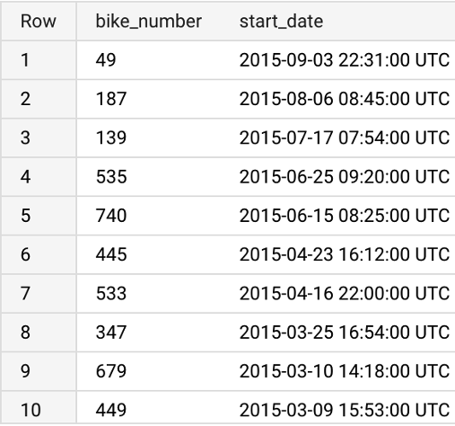

# sql-window-functions
## Standard Exercise
1. You’ll be using the data contained in the `bigquery-public-data.san_francisco.bikeshare_trips` table, but since it’s quite a large table, you’ll create a copy of it in your personal data set (called DataAnalytics in my case), making sure you only keep observations where the start_date was in 2015. Call the new table sf_bikeshare_2015.
2. What’s the average number of trips per bike in 2015?
3. Which month has the highest number of trips per bike?
4. What is the monthly average number of trips per bike? (hint: here the result should be a single number)
5. Which bike has made the most trips?
6. Write a query that, for each bike_number, keeps only the start_date of the first trip it took in 2015 (your output should be a table where each row has a distinct bike_number and that bike’s first start_date for the year); which bike_number had the latest start_date? Which month was it?
7. Thinking about the previous question, did you find the result odd? Remember that you have filtered the table keeping only data for the year 2015. You should have found that the first trip of 2015 for bike 49 took place in September (see screenshot below), which is quite strange. Think about what are the possible explanations for this fact and what would you do to investigate and possibly validate your hypothesis?

8. Write a query that shows, for each month, the number of bikes that started their first trip on that month.
9. Does the distribution from the previous question make sense? What is it telling you?
10. You report the information from the previous two points to your boss; he finds it very interesting and wants to investigate the matter further, so he asks you to give him a list containing the (16) bike_number of every bike with a first start_date from March or later.
## Advanced Exercise (optional):
1. The DataAnalytics.sf_bikeshare_2015 table contains a column called subscriber_type which, as you can read in the field description of the schema tab, has two categories:
Subscriber = annual or 30-day member
Customer = 24-hour or 3-day member
1. You have been asked to perform an analysis on the different user’s behaviour between those two types of customers. Explore the data and write one or more queries that show your results.
2. In the screenshot below is an example of such an analysis (but feel free to expand and go beyond this); what are these results telling you?

1. As you can see on the San Francisco Municipal Transportation Agency website, there are different fares based on your type of subscription: $0.20/min for Subscribers; $0.30/min for Customers. After recreating the table in the screenshot above, add a new column called “revenue” that shows how much revenue was generated by each subscriber_type in 2015. Do you see anything interesting? Think about how you would report this insight to your boss.
